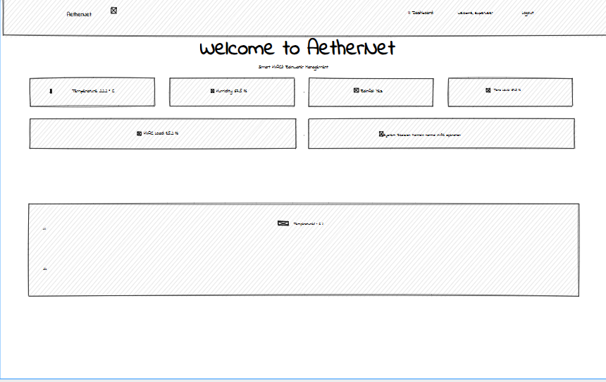
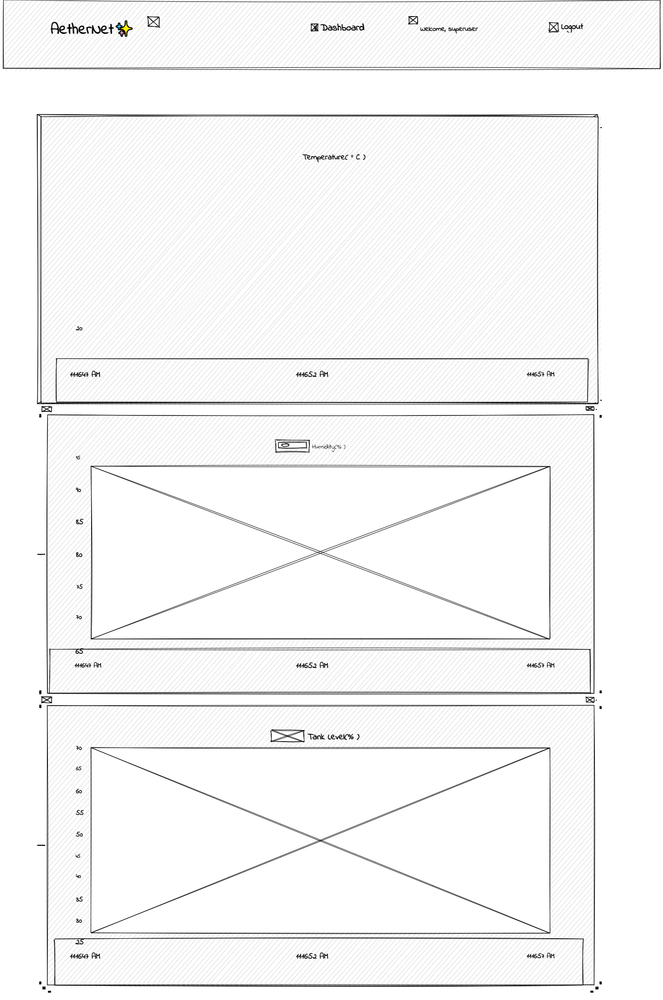
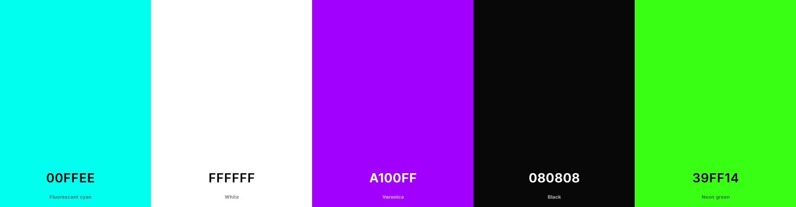

# AetherNet - Rainwater & HVAC Dashboard System

This project is a smart environmental control dashboard that integrates live weather data, HVAC decision logic, and a simulated rainwater tank system.

## 📖 Table of Contents
- [Overview](#overview)
- [Backend (Python / Django)](#backend-python--django)
- [Frontend](#frontend)
- [System Flow](#system-flow)
- [UI Design & Accessibility](#sustainable-accessible--thematic-ui-design)
- [Testing](#sensor-data-tests)
- [Future Features](#future-iterations-and-features)

---

## Overview

This system does the following:

- Retrieves **live weather data** from OpenWeatherMap.
- Simulates a **rainwater tank** that fills with rain or depletes with usage.
- Evaluates environmental conditions and makes **HVAC operation decisions**.
- Allows a **manual override** to redirect rainwater.
- Displays real-time data and decisions on a web dashboard with charts.

### Scope

AetherNet will provide a real-time dashboard that visualises environmental data, simulates tank behaviour, and applies HVAC logic based on current weather conditions. It does not include hardware integration at this stage or predictive analytic features.

### User Stories & Acceptance Criteria

| User Story | Acceptance Criteria | How It Is Met |
|------------|---------------------|----------------|
| As a **facility manager**, I want to **see the real-time tank water level**, so that I can **plan usage accordingly**. | - Dashboard displays tank water level as a percentage<br>- Data updates every 5 seconds<br>- Value accurately reflects rain and usage | - `get_sensor_data()` calculates tank level in backend<br>- Frontend fetches data from `/sensors/api/sensor-data/` every 5s<br>- Tank level displayed as `%` and in chart using Chart.js |
| As a **facility manager**, I want to **manually override the system**, so that I can **redirect water when needed**. | - A button is visible to toggle water redirection<br>- POST request updates system state<br>- Dashboard reflects override status visually and in decision message | - Manual override sends POST to `/sensors/api/manual-override/`<br>- `redirecting_water` flag toggled in backend<br>- UI updates button label and status text accordingly |
| As a **member of the Green Team**, I want to **view temperature and humidity**, so that I can **understand water tank level and usage context**. | - Temperature and humidity shown on dashboard<br>- Historical chart view available for trends<br>- Values update live every 5 seconds | - API fetch includes `temperature` and `humidity`<br>- DOM and Chart.js display values in real-time<br>- Wireframes support UX for both instant and trend monitoring |

---

## Backend (Python / Django)

### `/sensors/api/sensor-data/` — `get_sensor_data()`

- Calls the OpenWeatherMap API.
- Simulates tank behaviour:
  - **If raining:** Adds water to the tank based on rainfall volume.
  - **If dry:** Simulates water usage and decreases tank volume.
- Tank level is calculated as a percentage:
  - `tank_level = (current_volume / tank_capacity) * 100`
- Prepares and returns:
  - Temperature
  - Humidity
  - Rainfall (bool)
  - Tank level (%)
  - HVAC load (%)
  - System decision (manual or automatic)

### Tank Simulation Formula

#### **Rainfall Collection**
```python
collected_litres = rainfall_mm * catchment_area_m2 * runoff
Water Usage:
usage_liters = random between 10–30 L
Tank capacity: 1000 L
Initial volume: 500 L 
Catchment area: 50 m² 
Runoff coefficient: 0.8

evaluate_hvac_decision(data) 

Decision rules:
If raining and tank > 90% → Redirect excess rainwater. 

If humidity > 80% and raining → Reduce HVAC cooling. 

If temperature < 10°C → Increase heating. 

Otherwise → Maintain normal HVAC operation. 

/sensors/api/manual-override/ — manual_override()

Toggles the redirecting_water flag:

If True: "Redirecting excess rainwater to irrigation" 
If False: "Stop redirecting rainwater to avoid overuse" 

Manual override takes precedence over automatic decisions.
```
## Frontend

### Wireframe UX Planning 




### Colour Scheme 



I wanted a futuristic look to the dashboard with the purple representing the company colours and both the Flourescent Cyan and Neon Green being very accessible contrasting colours against the black but also representing the colours of water and sustainability with their 'blue' and 'green' shades.

### **Real-Time Sensor Updates**
Runs **every 5 seconds**:
- Fetches data from `/sensors/api/sensor-data/`
- Updates:
  - **DOM elements** (temperature, humidity, tank level)
  - **Chart.js line graphs** (temperature, humidity, tank level)

---

### **Charts**
- **Temperature (°C)**
- **Humidity (%)**
- **Tank Level (%)**
- Rendered using **Chart.js**, updated **every 5 seconds**.

---

### **Manual Override Button**
- Sends **POST request** to `/sensors/api/manual-override/`
- Updates:
  - **Decision text** on dashboard
  - **Button label toggle**:
    - `"Start Water Redirection"` ↔ `"Stop Water Redirection"`

---

## **System Flow**
```text
Client → (every 5s) → /sensor-data/
          ↓
Weather API → Rainfall info → Adjust Tank Volume
          ↓
Manual Override 
          ↓
← sensor data + decision ← Backend
          ↓
Charts + DOM updated live
```
### Sustainable, Accessible & Thematic UI Design

The application's design embraces a clean, modern aesthetic while reflecting the core values of sustainability and innovation. The chosen colour palette supports accessibility and aligns with our eco-conscious and user-friendly clean-cut view:

- **Primary Background Colours**:  
  - `--bg-color: #080808` (deep black) and `--second-bg-color: #131313` offer high contrast with text, improving readability for users with visual impairments.
- **Primary Accent**:  
  - `--main-color: #00ffee` is a bright cyan tone symbolising water and energy efficiency.
- **Highlight & Action Colours**:  
  - `--highlight-color: #A100FF` (electric violet) is to stay in sync with the company colours and `--accent-color: #39FF14` (neon green) is vivid yet harmonious. They guide attention to interactive elements without overwhelming users.
- **Typography**:  
  - We use `"Poppins", sans-serif` — a highly legible, modern typeface suitable for digital interfaces.


#### 🔍 Accessibility Considerations

- High-contrast text and background ensure WCAG-friendly colour contrast ratios.
- Responsive layout adjusts seamlessly across screen sizes, enhancing usability on mobile and tablet devices.
- Clear visual feedback on interactive elements (hover states, focus outlines, and animations) helps users with cognitive or motor impairments.
- Simple language, consistent structure, and smooth scroll behaviour contribute to an intuitive user experience.

#### Performance and Accessibility Testing

**Google Lighthouse** to audit the web application’s performance, accessibility, best practices, and SEO. 

Below are the results:

- Desktop Lighthouse Report


- Mobile Lighthouse Report


Manual testing was also conducted by seeing if a user could register and then log in, if a perso could try to login without valid details. 
Clicking buttons to check they worked.
Checking via the inspect window that the application moved dynamically so the user could access from desktop, tablet or mobile devices.

#### Design with Purpose

The overall aesthetic balances futuristic tech themes with eco-forward messaging. Every visual element — from the glowing sensor boxes to the smooth animation transitions — is designed to reinforce a message of clean, smart, and sustainable innovation.

# Sensor Data Tests

This test suite contains several unit tests for the `SensorData` view and the decision-making logic in the `evaluate_hvac_decision` function. These tests cover different scenarios such as fetching sensor data, handling different weather conditions, and testing manual overrides. Below is a breakdown of each test.

### 1. `test_get_sensor_data_with_live_weather`

- **Purpose**: Tests if the sensor data is fetched correctly when live weather data is available.
- **Mocked Data**:
  - Weather API returns a temperature of 25°C, humidity of 60%, and clear sky conditions.
  - Random data is used to simulate the tank volume changes.
- **Expected Behaviour**:
  - A successful response with a status code of 200.
  - The response contains sensor data and a decision.
  - The tank level should be updated correctly (0 <= tank level <= 100).

### 2. `test_get_sensor_data_with_mock_data`

- **Purpose**: Tests the fallback scenario when the Weather API fails.
- **Mocked Data**:
  - The Weather API is simulated to fail (raising an exception).
  - Random data is used to simulate the tank volume changes.
- **Expected Behaviour**:
  - A successful response with a status code of 200.
  - The response should contain mocked sensor data and a decision.
  - The tank level should be updated correctly (0 <= tank level <= 100) even with mock data.

### 3. `test_hvac_decision_rain_and_full_tank`

- **Purpose**: Tests the HVAC decision logic when it is raining and the tank is almost full.
- **Input Data**:
  - Temperature: 22°C
  - Humidity: 50%
  - Rainfall: True
  - Tank Level: 95%
  - HVAC Load: 50
- **Expected Behaviour**: 
  - The decision should be to "Redirect excess rainwater to irrigation" since the tank is almost full, and it is raining.

### 4. `test_hvac_decision_high_humidity_and_rain`

- **Purpose**: Tests the HVAC decision logic when the humidity is high, and it is raining.
- **Input Data**:
  - Temperature: 25°C
  - Humidity: 85%
  - Rainfall: True
  - Tank Level: 50%
  - HVAC Load: 50
- **Expected Behaviour**:
  - The decision should be to "Reduce HVAC cooling & store rainwater" since it is raining and the humidity is high.

### 5. `test_hvac_decision_low_temperature`

- **Purpose**: Tests the HVAC decision logic when the temperature is low.
- **Input Data**:
  - Temperature: 5°C
  - Humidity: 50%
  - Rainfall: False
  - Tank Level: 50%
  - HVAC Load: 50
- **Expected Behaviour**:
  - The decision should be to "Increase heating for comfort" because the temperature is low.

### 6. `test_hvac_decision_normal`

- **Purpose**: Tests the HVAC decision logic under normal conditions.
- **Input Data**:
  - Temperature: 22°C
  - Humidity: 60%
  - Rainfall: False
  - Tank Level: 50%
  - HVAC Load: 50
- **Expected Behaviour**:
  - The decision should be to "Maintain normal HVAC operation" since the conditions are neither extreme nor require any adjustments.

### 7. `test_manual_override_on`

- **Purpose**: Tests the manual override to enable redirecting rainwater to irrigation.
- **Mocked Data**:
  - Weather API returns a temperature of 25°C, humidity of 60%, and clear sky conditions.
- **Expected Behaviour**:
  - After the manual override is triggered, the decision should be updated to "Redirecting excess rainwater to irrigation".
  - A successful response with a status code of 200.

### 8. `test_manual_override_off`

- **Purpose**: Tests the manual override to disable redirecting rainwater to irrigation.
- **Mocked Data**:
  - Weather API returns a temperature of 25°C, humidity of 60%, and clear sky conditions.
- **Expected Behaviour**:
  - After the manual override is triggered twice (first enabling, then disabling), the decision should be updated to "Stop redirecting rainwater to avoid overuse".
  - A successful response with a status code of 200.


## Future Iterations and Features

- Accuracy will improve once intergrated to the buildings physical sensor via MQTT
- Persistent and current tank volume data to be stored in a database. And source predictive analytics to be able to anticipate future savings based on past data.
- Smart Notifications to alert users when tank level adjustments are critically low, high or changed.